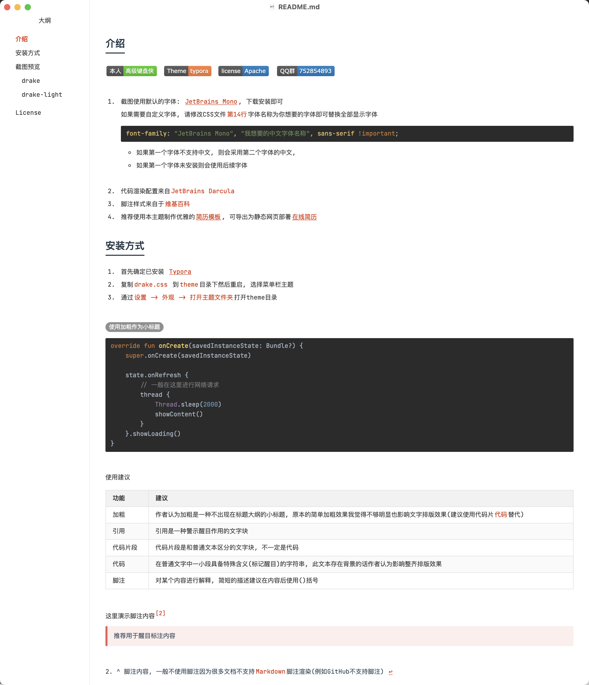

# typora theme

自己基于已有主题进行修改得到或自己开发的typora主题。

遵循原则：

1. clear：清晰优先，不会采用背景图等干扰文字编码和阅读的效果，希望使用时专注于文字、内容，同时做到不同部分层次分明、一眼能清晰地分辨结构，比如段落之间间距与行距差距加大，h1-h4标题差异大。
2. 温和、不刺眼、耐看。色彩上不会选用饱和度特别高的，看久了容易心理上产生疲劳。但也不会选用较低的，给人一种昏昏欲睡的感觉。追求的是：要强调的部分能迅速捕获读者眼球，但又不刺眼。比较偏好科技蓝的色彩。

自己觉得比较值得参考的一些主题：
 https://github.com/16soundsofsilence/typora-gitbook-theme

=======