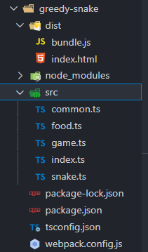

# typescript实战 贪吃蛇

做这个demo主要是学了typescript后想练习一下。

主要功能点和传统的贪吃蛇一样：

- 吃了食物后身体加一节，重新生成新的食物。
- 碰壁或撞到自己后死亡，结束游戏。
- 记录得分，每加10分level+1，最高level10。level越高，速度越快。

> 参考（看视频借鉴思路，代码都自己思考、分析、手敲）：
>
> - 尚硅谷2021版TypeScript教程（李立超老师TS新课）_哔哩哔哩 (゜-゜)つロ 干杯~-bilibili
>   https://www.bilibili.com/video/BV1Xy4y1v7S2?p=24


主要功能思路：

- 给蛇的每一节加个和背景色同色的边框，形成一节节的效果。
- 蛇的移动：每定时一段时间步进一格。监听按键方向键改变direction，头部按direction方向移动，后面从后面每一节开始，让后一节的坐标等于前一节的坐标，从而实现蛇身体的移动。
- 当蛇头部坐标等于食物坐标时，视为吃到、得分，给蛇元素增加一个子元素，生成随机坐标并赋值给食物。
- 蛇增加一节，就是新建一个子元素，然后根据当前运动方向和蛇当前最后一节的坐标，来计算新一节的坐标，然后挂载到蛇元素上。
- 撞墙和撞自身的检测：检测头部坐标，如果超出范围则撞墙（当移动到坐标刚好是范围外一格时，即撞墙，不需要在坐标等于范围边界时再额外定时检测是否撞墙。因为本身是定时步进移动的，如果定时到了就会自动移动然后超出范围、即撞墙，如果这个时间范围内按下按键改变方向，即不会移动超出范围、撞墙），如果与自身某一节坐标相同则撞自身。
- 根据效果，初始定时300ms是比较合适的。后面可以根据level的值相应减小。


项目开发环境部署：webpack+typescript

安装`webpack`、`webpack-cli`、`typescript`、`ts-loader`。

项目结构：



相关配置文件：

package.json：

```json
{
  "name": "webpack-ts",
  "version": "1.0.0",
  "description": "",
  "main": "index.js",
  "dependencies": {
    "ts-loader": "^9.1.0",
    "typescript": "^4.2.4"
  },
  "devDependencies": {
    "webpack": "^5.35.0",
    "webpack-cli": "^4.6.0"
  },
  "scripts": {
    "test": "echo \"Error: no test specified\" && exit 1",
    "build": "webpack"
  },
  "author": "",
  "license": "ISC"
}

```

tsconfig.json：

```json
{
  "compilerOptions": {
    "outDir": "./dist/",
    "sourceMap": true,
    "noImplicitAny": true,
    "module": "es6",
    "target": "es5",
    "jsx": "react",
    "allowJs": true
  }
}
```

webpack.config.js：

```javascript
const path = require('path');

module.exports = {
  entry: './src/index.ts',
  devtool: 'inline-source-map',
  module: {
    rules: [
      {
        test: /\.tsx?$/,
        use: 'ts-loader',
        exclude: /node_modules/
      }
    ]
  },
  resolve: {
    extensions: [ '.tsx', '.ts', '.js' ]
  },
  output: {
    filename: 'bundle.js',
    path: path.resolve(__dirname, 'dist')
  }
};
```


工程源码：

index.html：

```html
<!doctype html>
<head>
<title>贪吃蛇</title>
<style>
:root {
  --game-panel-background: #eee;
}
#container {
  margin: 50px auto 0 auto;
  width: 320px;
  height: 360px;
  padding: 20px 10px 10px 10px;
  border: 2px solid #000;
  background: rgb(206, 206, 206);
  display: flex;
  flex-wrap: wrap;
  justify-content: center;
  align-items: space-between;
  border-radius: 10px;
}
#game-panel {
  width: 300px;
  height: 300px;
  border: 2px solid #000;
  background-color: var(--game-panel-background);
  position: relative;
}
#game-panel #food {
  width: 10px;
  height: 10px;
  /* box-sizing: border-box;
  border: 1px solid var(--game-panel-background); */
  /* background: blue; */
  position: absolute;
  left: 150px;
  top: 150px;
  /* background-image: linear-gradient(45deg, blue 25%, transparent 0),
                    linear-gradient(45deg, transparent 75%, blue 0);
  background-position: 0 0, 5px 5px;
  background-size: 10px 10px; */
  font-size: 2px;
}
#game-panel #food>span {
  font-size: 2px;
}
#game-panel #snake #snake-head,#snake-body {
  background: rgb(15, 15, 15);
  width: 10px;
  height: 10px;
  border: 1px solid var(--game-panel-background);
  box-sizing: border-box;
  position: absolute;
}
#snake-head {
  border-radius: 10px;
}
#score-panel {
  width: 300px;
  display: flex;
  justify-content: space-between;
}
#score-panel span {
  font-family: courier;
  font-size: 20px;
  font-weight: bold;
}
#game-status {
  font-family: courier;
  font-weight: bold;
}
</style>
</head>
<body>
<div id="container">
  <div id="game-panel">
    <div id="food"><span>&#8984;</span></div>
    <div id="snake">
      <div id="snake-head"></div>
    </div>
  </div>
  <div id="score-panel">
    <span>score:<span id="score">0</span></span>
    <span>level:<span id="level">1</span></span>
  </div>
  <div id="game-status">game running</div>
</div>
<script src="./bundle.js"></script>
</body>
```

common.ts：

```typescript
class Common {
  static CEIL_SIZE = 10;  // 每个小单元格为10px
  static N = 30;  // 可移动区域为30*30的网格
  static debounceDecorator (fn : (event: KeyboardEvent)=>void, delay: number) {
    let timer : number;
    return function(event: KeyboardEvent) {
      if (timer !== null) {
        clearTimeout(timer);
      }
      timer = window.setTimeout(()=>{
        fn(event);
      }, delay);  // typescript下setTimeout函数返回类型比较奇怪，所以改用window.setTimeout，返回类型为number，为timer ID
    }
  }
}
export default Common;
```

food.ts：

```typescript
import Common from './common'
class Food {
  element: HTMLElement;
  constructor() {
    this.element = document.getElementById('food') as HTMLElement;
  }
  // 获取食物的x坐标
  get X() {
    return Math.floor(this.element.offsetLeft / Common.CEIL_SIZE);
  }
  // 获取食物的y坐标
  get Y() {
    return Math.floor(this.element.offsetTop / Common.CEIL_SIZE);
  }
  // 食物被吃后需要新建食物（改变food元素的位置）
  change() {
    let newX = 10 * Math.floor(Math.random() * (Common.N - 1));
    let newY = 10 * Math.floor(Math.random() * (Common.N - 1));
    this.element.style.left = `${newX}px`;
    this.element.style.top = `${newY}px`;
  }
}

export default Food;
```

game.ts：

```typescript
import Snake from './snake';
import Food from './food';
import Common from './common';

const map = new Map();  // key为按键，value为方向
map.set('ArrowUp', 'up');
map.set('ArrowDown', 'down');
map.set('ArrowLeft', 'left');
map.set('ArrowRight', 'right');

class Game {
  snake: Snake;
  levelElement: HTMLElement;
  scoreElement: HTMLElement;
  food: Food;
  isLive: boolean;
  constructor() {

    this.snake = new Snake();
    this.scoreElement = document.getElementById('score');
    this.levelElement = document.getElementById('level');
    this.food = new Food();
    this.isLive = true;
  }

  private moveSnake = ()=>{
    const level : number = Number.parseInt(this.levelElement.innerText);
    let timer = setInterval(()=>{
      this.snake.step();
      this.checkScore();
      this.checkTouchWall();
      if (this.snake.checkTouchSelf()) {
        this.isLive = false;
      }
      if (this.isLive === false) {
        let gameStatusEle = document.getElementById('game-status');
        gameStatusEle.innerText = 'game failed!';
        clearInterval(timer);
      }
    }, 300 - 20*(level-1));
  }
  private checkScore = ()=>{
    const foodX = this.food.X;
    const foodY = this.food.Y;
    const snakeHeadX = this.snake.X;
    const snakeHeadY = this.snake.Y;
    if (foodX === snakeHeadX && foodY === snakeHeadY) {  // 吃到食物了
      // 更新分数
      const newScore = Number.parseInt(this.scoreElement.innerText) + 1;
      this.scoreElement.innerText = String(newScore);
      // 更新level
      if (newScore % 10 === 0) {
        const newLevel = Number.parseInt(this.levelElement.innerText) + 1;
        if (newLevel <= 10) {
          this.levelElement.innerText = String(newLevel);
        }
      }
      // 蛇身体增长一节
      this.snake.grow();
      // 更新食物
      this.food.change();
    }
  };
  // 碰墙检测
  private checkTouchWall = ()=>{
    const snakeHeadX = this.snake.X;
    const snakeHeadY = this.snake.Y;
    if (snakeHeadX >= Common.N || snakeHeadX < 0 ||
        snakeHeadY >= Common.N || snakeHeadY < 0) {
      this.isLive = false;
    }
  }
  public play = ()=>{
    let self = this;
    this.moveSnake();
    function keyDownHandler(event: KeyboardEvent) : void {
      let key = event.key;
      // 现在是垂直方向，只能左右按键改变方向
      // 现在是水平方向，则只能垂直方向按键改变方向
      if ((self.snake.direction === 'up' || self.snake.direction === 'down') &&
          (key === 'ArrowLeft' || key === 'ArrowRight')) {
        self.snake.direction = map.get(key);
      }
      if ((self.snake.direction === 'left' || self.snake.direction === 'right') &&
          (key === 'ArrowUp' || key === 'ArrowDown')) {
        self.snake.direction = map.get(key);
      }
    }
    let fn = Common.debounceDecorator(keyDownHandler, 100)
    // 加延迟。避免用户迅速按下两个键（比如当前左移动，用户按下上键又立即按下右键）
    document.addEventListener('keydown', fn);
  }
}

export default Game;
```

index.ts：

```typescript
import Game from './game';

let game = new Game();
game.play();
```

snake.ts：

```typescript
import Common from './common';

type Direction = 'up' | 'down' | 'left' | 'right';

class Snake {
  element: HTMLElement;    // 整个蛇的元素
  head: HTMLElement;       // 蛇的头部
  direction: Direction;    // 当前移动方向
  constructor() {
    this.element = document.getElementById('snake') as HTMLElement;
    this.head = document.getElementById('snake-head') as HTMLElement;
    this.head.style.left = '0px';
    this.head.style.top = '0px';
    this.direction = 'right';
  }
  get X() : number{
    const res = Math.floor(this.head.offsetLeft / Common.CEIL_SIZE);
    return res;
  }
  get Y() : number{
    const res = Math.floor(this.head.offsetTop / Common.CEIL_SIZE);
    return res;
  }
  stepLeft() : void {
    const headNewX = this.head.offsetLeft - Common.CEIL_SIZE;
    this.head.style.left = `${headNewX}px`;
  }
  stepRight() : void {
    const headNewX = this.head.offsetLeft + Common.CEIL_SIZE;
    this.head.style.left = `${headNewX}px`;
  }
  stepUp() : void {
    const headNewY = this.head.offsetTop - Common.CEIL_SIZE;
    this.head.style.top = `${headNewY}px`;
  }
  stepDown() : void {
    const headNewY = this.head.offsetTop + Common.CEIL_SIZE;
    this.head.style.top = `${headNewY}px`;
  }
  step = ()=>{
    this.refreshBody();
    switch (this.direction) {
      case 'up' : {
        this.stepUp();
        break;
      }
      case 'down': {
        this.stepDown();
        break;
      }
      case 'left': {
        this.stepLeft();
        break;
      }
      case 'right': {
        this.stepRight();
        break;
      }
      default: {
        const exhaustiveCheck : never = this.direction;
        break;
      }
    }
  }
  // 蛇头移动一格后，后面也需要跟上（实际就是从最后一节开始，让每节等于前一节的位置）
  private refreshBody(): void {
    let bodySections = this.element.children;
    if (bodySections.length <= 1) {  // 只有蛇头，没有其他部分，不需要补齐
      return;
    }
    for (let i = bodySections.length-1; i > 0; i--) {
      const next = bodySections[i-1] as HTMLElement;
      let current = bodySections[i] as HTMLElement;
      const nextX = next.offsetLeft;
      const nextY = next.offsetTop;
      current.style.left = `${nextX}px`;
      current.style.top = `${nextY}px`;
    }
  }
  // 当吃到食物后身体增长一节
  grow(): void {
    // 根据当前最后一节的位置和移动方向确定新节的位置
    const currLastSection = this.element.lastElementChild as HTMLElement;
    let newSection = document.createElement('div');
    newSection.id = 'snake-body';
    let newSecX = currLastSection.offsetLeft;
    let newSecY = currLastSection.offsetTop;
    switch (this.direction) {
      case 'up': {  // 向上方向，新节在最后一节的下面一格位置
        newSecY += Common.CEIL_SIZE;
        break;
      }
      case 'down': {  // 向下方向，新节在最后一节的上面一格位置
        newSecY -= Common.CEIL_SIZE;
        break;
      }
      case 'left': {  // 向左方向，新节在最后一节的右边一格位置
        newSecX += Common.CEIL_SIZE;
        break;
      }
      case 'right': { // 向右方向，新节在最后一节的左边一格位置
        newSecX -= Common.CEIL_SIZE;
        break;
      }
      default: {
        const exhaustiveCheck : never = this.direction;
        break;
      }
    }
    newSection.style.left = `${newSecX}px`;
    newSection.style.top = `${newSecY}px`;
    this.element.appendChild(newSection);
  }
  // 判断头部有没有撞到自己的身体
  checkTouchSelf = ()=>{
    let bodySections = this.element.children;
    for (let i = bodySections.length-1; i > 0; i--) {
      let sec = bodySections[i] as HTMLElement;
      if (this.X * Common.CEIL_SIZE === sec.offsetLeft &&
          this.Y * Common.CEIL_SIZE === sec.offsetTop) {
        return true;
      }
    }
    return false;
  }
}

export default Snake;
```

